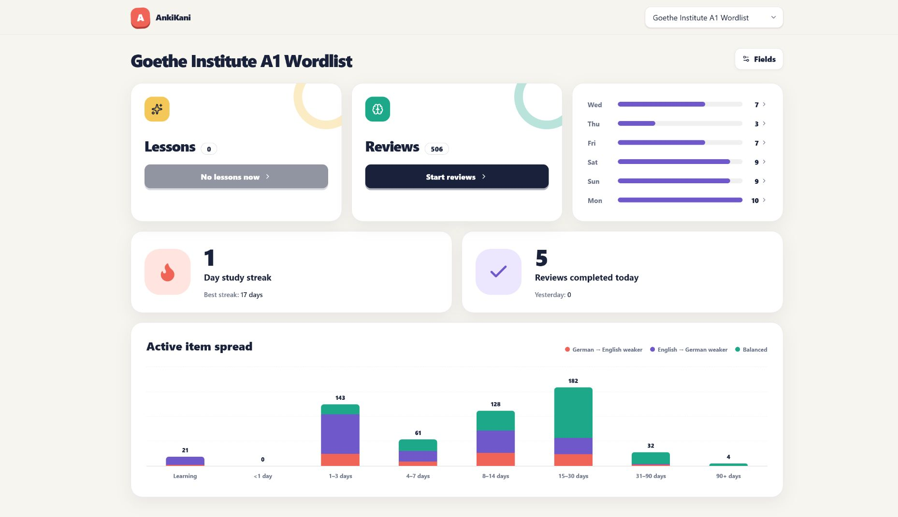
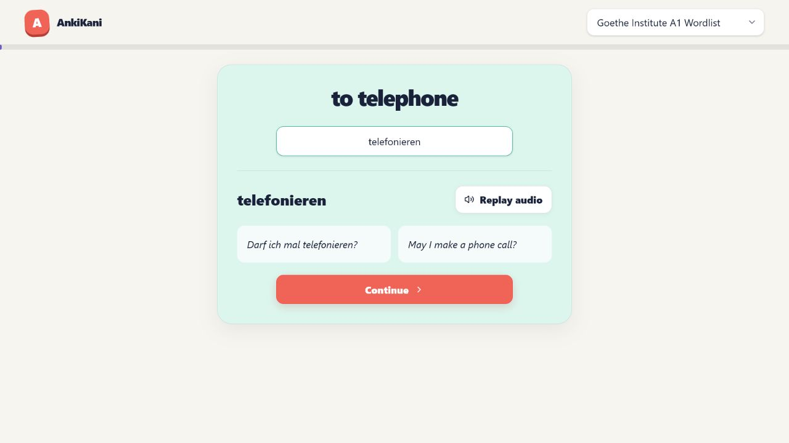

# AnkiKani

Typed-recall web client for Anki vocabulary decks. Anki remains the source of
truth; AnkiKani reads cards and submits `Again` or `Good` through AnkiConnect.
It does not manage decks or edit cards.





## Run

Requires [Bun](https://bun.sh/), Anki Desktop, and AnkiConnect add-on
`2055492159`.

Install AnkiConnect from **Tools → Add-ons → Get Add-ons**, restart Anki, then:

```powershell
bun install
bun run build
bun start
```

Anki desktop should be running for AnkiConnect to work.